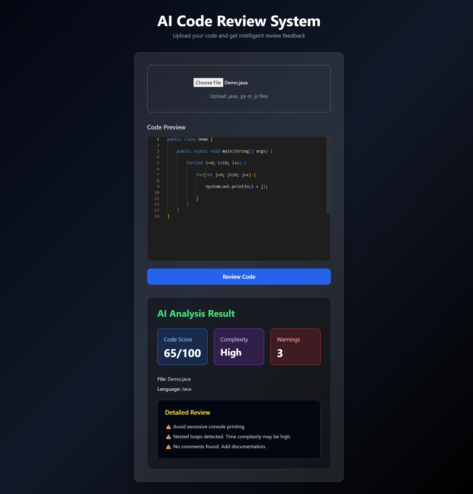

# AI Code Review System 🚀

An AI-powered full-stack web application that reviews source code files and provides intelligent feedback on code quality, complexity, maintainability, and best practices.

---

## ✨ Features

- 📂 Upload Java, Python, and JavaScript files
- 🤖 AI-generated code review and suggestions
- 📊 Code quality analysis
- ⚠️ Warning detection
- 🎨 Modern responsive UI
- 📝 Monaco code editor integration
- 🔗 Full-stack architecture using Spring Boot + React
- 💾 MySQL database integration

---

## 🛠️ Tech Stack

### Frontend
- React.js
- Tailwind CSS
- Axios
- Monaco Editor

### Backend
- Java
- Spring Boot
- Spring Data JPA
- REST APIs

### Database
- MySQL

### AI Integration
- OpenAI API

---

## 📸 Screenshots

### Home Page


### AI Analysis Result


---

## ⚙️ Installation & Setup

# 1️⃣ Clone Repository

```bash
git clone https://github.com/M-Poojitha04/ai-code-review-system.git
```

---

# 2️⃣ Backend Setup

Navigate to backend:

```bash
cd backend/ai-code-review
```

Run Spring Boot application:

```bash
mvn spring-boot:run
```

Backend runs on:

```text
http://localhost:8080
```

---

# 3️⃣ Frontend Setup

Navigate to frontend:

```bash
cd frontend/ai-code-review-frontend
```

Install dependencies:

```bash
npm install
```

Start React app:

```bash
npm start
```

Frontend runs on:

```text
http://localhost:3000
```

---

## 📂 Project Structure

```text
ai-code-review-system/
│
├── backend/
│   └── ai-code-review/
│
├── frontend/
│   └── ai-code-review-frontend/
```

---

## 🔥 Future Improvements

- GitHub Repository Analyzer
- Multi-file project analysis
- Authentication & User Accounts
- Deployment on Render/Vercel
- AI-powered refactoring suggestions

---

## 👩‍💻 Author

### Poojitha Machrla

GitHub:
https://github.com/M-Poojitha04